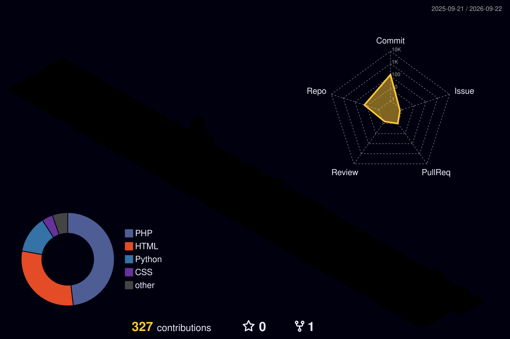

<!-- Para ativar os widgets dinâmicos (cobra + gráfico 3D), veja o arquivo SETUP.md deste repositório. -->
<div align="center">
  <!-- Banner Topo Cyberpunk (gradiente roxo -> vermelho + estrelas em movimento) -->
  

  <!-- Typing SVG Animação -->
  <a href="https://git.io/typing-svg">
    
  </a>
</div>

<br />

<div align="center">
  <a href="https://www.linkedin.com/in/guilherme-batistela-machado/" target="_blank">
    
  </a>
  <a href="https://mypersonallinks.netlify.app" target="_blank">
    
  </a>
  <a href="https://instagram.com/gbm_clicks" target="_blank">
    
  </a>
</div>

<div align="center">
  
  
</div>

<br />

<div align="center">
  
</div>

---

### 🥷 `[0x01] // Sobre Mim`

```sys
┌──(root⚡guiibm)-[~/profile]
└─$ cat user_info.json
```

```json
{
  "nome": "Guilherme Batistela Machado",
  "foco_carreira": "Segurança da Informação / Red Team",
  "stack_desenvolvimento": ["Python", "C++", "C", "PHP", "JavaScript"],
  "domínios": ["Segurança Ofensiva", "Desenvolvimento Web", "Automação & Scripts"],
  "status": "Estudante & Pesquisador de Segurança",
  "hobby": "Fotografia (@gbm_clicks)"
}
```

> **Diretório Operacional:**
> - 🎯 **Alvo**: Dominar técnicas de Segurança Ofensiva (Red Team), análise de vulnerabilidades e exploração web.
> - ⚡ **Mentalidade**: Entender como os sistemas são construídos (C, C++, PHP, JS, Python) para entender exatamente como quebrá-los e blindá-los.
> - 🌐 **Central de Links**: Agrupei todas as minhas plataformas e projetos em um único hub: [mypersonallinks.netlify.app](https://mypersonallinks.netlify.app).

---

### 🛠️ `[0x02] // Arsenal Tecnológico`

#### 💻 Linguagens de Programação & Web
<p>
  
  
  
  
  
  
  
</p>

#### 🔴 Foco & Especialidades em CyberSec
<p>
  
  
  
  
  
  
</p>

<div align="center">
  
</div>

---

### 🚀 `[0x03] // Projetos & Portfólio`

<table width="100%">
  <tr>
    <td width="100%" valign="top">
      <h3 align="center">🌐 Hub de Projetos & Links Pessoais</h3>
      <p align="center">
        Plataforma centralizada onde organizo meus projetos em desenvolvimento, redes e portfólio de segurança da informação.
      </p>
      <p align="center">
        <code>HTML</code> &nbsp; <code>CSS</code> &nbsp; <code>JavaScript</code> &nbsp; <code>Netlify</code>
      </p>
      <div align="center">
        <a href="https://mypersonallinks.netlify.app" target="_blank">
          
        </a>
      </div>
    </td>
  </tr>
</table>

---

### 🐍 `[0x04] // Atividade em Tempo Real`

<div align="center">
  <picture>
    <source media="(prefers-color-scheme: dark)" srcset="https://raw.githubusercontent.com/GuiiBM/GuiiBM/output/github-snake-dark.svg" />
    <source media="(prefers-color-scheme: light)" srcset="https://raw.githubusercontent.com/GuiiBM/GuiiBM/output/github-snake.svg" />
    
  </picture>
  <p><i>Consumindo, célula por célula, cada dia de contribuição.</i></p>
</div>

---

### 📅 `[0x05] // Calendário 3D de Contribuições`

<div align="center">
  
  <p><i>O histórico inteiro de commits, em perspectiva isométrica.</i></p>
</div>

---

### 🏆 `[0x06] // Conquistas no GitHub`

<div align="center">
  
</div>

---

### 📊 `[0x07] // Métricas de Código`

<div align="center">
  
  
</div>

<br />

<div align="center">
  
</div>

<br />

#### 📈 Gráfico Temporal de Atividades
<div align="center">
  
</div>

<div align="center">
  
</div>

---

### 🌐 `[0x08] // Conexões & Redes`

<div align="center">
  <a href="https://www.linkedin.com/in/guilherme-batistela-machado/" target="_blank">
    
  </a>
  <a href="https://instagram.com/gbm_clicks" target="_blank">
    
  </a>
  <a href="https://mypersonallinks.netlify.app" target="_blank">
    
  </a>
</div>

<br />

<div align="center">
  
  <p><code>"Security is not a product, but a process."</code></p>
  <p><sub>(Bruce Schneier)</sub></p>
  <sub>Desenvolvido para <b>Guilherme Batistela Machado</b></sub>
</div>
